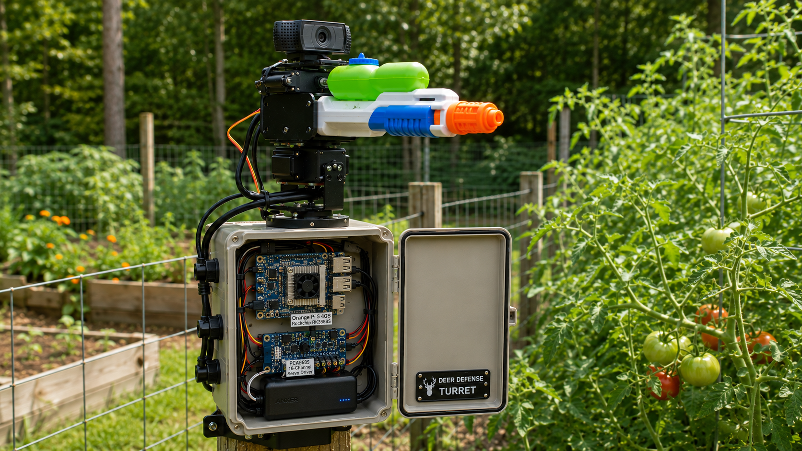

# Deer Defense System — Automated Water Gun Turret for Tomato Plants

An AI-powered, automated water gun turret that detects deer using computer vision and fires a water burst to deter them from your tomato plants.

---

## Project Overview

- **Goal**: Protect tomato plants from deer using a humane, automated water deterrent.
- **Detection**: YOLO-World v2 (open-vocabulary) — detects "deer" (or any text prompt: rabbit, groundhog, etc.)
- **Hardware**: Orange Pi 5 (RK3588 NPU) + USB camera + 2 servos + disassembled electric water gun
- **Inference**: Runs fully local/on-device, 24/7, no cloud needed
- **Inspired by**: [u/muxamilian's automated pigeon defense system](https://www.reddit.com/r/SideProject/comments/1s9ywir/automated_pigeon_defense_system/) (r/SideProject, April 2026)

---

## Concept Image



*AI-generated concept image of the assembled deer defense turret — [prompt link](prompt-for-image.md)*

---

## Bill of Materials (BOM)

| Component | Details | Link | Cost |
|---|---|---|---|
| Orange Pi 5 4GB | RK3588S NPU (6 TOPS), 8-core CPU, 26-pin GPIO | [Amazon](https://www.amazon.com/Orange-Pi-Frequency-Development-Android12/dp/B0BN16ZLXB) | $125 |
| Camera | Arducam 1080P, USB 2.0, automatic IR-cut day/night switching, Linux UVC | [Amazon](https://www.amazon.com/Arducam-Computer-Automatic-Switching-All-Day/dp/B0829HZ3Q7) | $35 |
| SD card | PNY Elite 32GB microSDHC Class 10 | [Amazon](https://www.amazon.com/PNY-Elite-microSDHC-Memory-3-Pack/dp/B07YXJM282) | $34 (3-pack) |
| Water gun | StimuVariety Electric Water Gun — USB rechargeable, DC motor pump ⚠️ untested | [Amazon](https://www.amazon.com/gp/product/B0GGB86N1X) | $40 (2-pack) |
| Servo motors (×4) | MG996R metal gear, 9.4 kg·cm torque, pan + tilt | [Amazon](https://www.amazon.com/4-Pack-MG996R-Torque-Digital-Helicopter/dp/B07MFK266B) | $18 (4-pack) |
| Pan-tilt bracket | DiGiYes aluminum alloy, MG996R compatible, includes U+L mounts ⚠️ untested | [Amazon](https://www.amazon.com/DiGiYes-Aluminum-U-Shaped-L-Shaped-Steering/dp/B0CP7FHC6L) | ~$11 (2-pack) |
| PCA9685 servo driver | HUAREW 16-channel I²C PWM driver — reduces jitter, frees GPIO (optional but recommended) | [Amazon](https://www.amazon.com/HUAREW-PCA9685-Interface-Compatible-Raspberry/dp/B0CRV3MK14) | $13 (2-pack) |
| Trigger circuit | IRLZ44N MOSFET + 10kΩ/220Ω resistors, or 5V relay module | — | ~$5 |
| Buck converter (×2) | DROK 12V→5V 5A USB — one per rail ⚠️ untested | [Amazon](https://www.amazon.com/Converter-DROK-Regulator-Inverter-Transformer/dp/B01NALDSJ0) | $15 (2-pack) |
| Misc electronics | Jumper wires, breadboard, Dupont connectors, heat shrink, fuse | — | ~$15 |
| Enclosure & mounting | Weatherproof box for Orange Pi, cable ties, silicone sealant, screws | — | ~$15–30 |
| **Total (estimated)** | | | **~$326–341** |

**Notes:**
- Water gun: look for a DC motor pump triggered by holding a button — easy to wire a MOSFET/relay in parallel with the trigger contacts
- Enclosure: IP65-rated project box recommended for outdoor use; add desiccant inside
- OS: Armbian (recommended for RK3588S) or official Orange Pi OS

---

## How It Works

1. A USB camera streams video continuously
2. YOLO-World identifies deer in the frame
3. Two servo motors aim the water gun at the target
4. A short water burst is triggered via a MOSFET/relay circuit
5. The system resets and keeps watching

Runs 24/7, fully local, no cloud required.

---

## Repository Structure

```
deer-defense-project/
├── obsidian_vault/
│   ├── 01-plan/
│   │   └── milestones.md         # Deployment steps and development plan
│   └── 02-design/
│       ├── orange-pi-5/          # AI model, detection loop, flowcharts
│       ├── camera/
│       ├── water-gun/
│       ├── pan-tilt-system/
│       ├── trigger-system/
│       └── power-system/         # Power budget, buck converter wiring
├── orange-pi-code/               # Python source code for the Orange Pi 5
├── CLAUDE.md                     # Project overview, BOM, how it works
├── README.md
└── .gitignore
```

---

## Contributing

Pull requests welcome. Open an issue first to discuss significant changes.

## License

MIT
