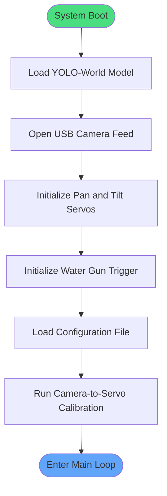

# Initialization

Runs once at system boot before the main loop starts.

## Notes

- **Model**: `yolov8l-worldv2` — open-vocabulary, so the target text prompt can be changed without retraining
- **Config values loaded**: target class, confidence threshold, cooldown duration, servo angle limits
- **Calibration**: maps pixel coordinates (e.g. 1920×1080) to servo angles (0–180°) — most important tuning step
- If any step fails, the system should log the error and halt rather than run uncalibrated

[Back to Overview](overview.md)
