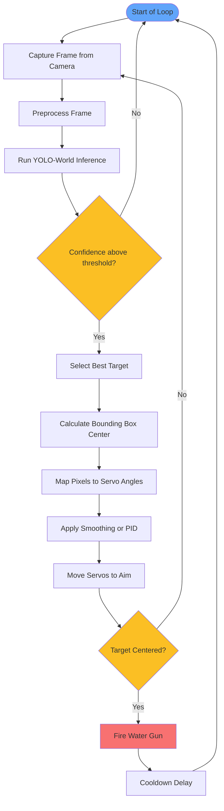

# Detection and Targeting Loop

Runs continuously at 10–30 FPS after initialization.



## Notes

- **YOLO-World text prompt**: `"deer"` — also try `"white-tailed deer"` for higher accuracy
- **Confidence threshold**: 0.5 recommended; lower = more triggers, higher = fewer false positives
- **Target selection**: pick the largest bounding box (deer are big) or highest confidence detection
- **Pixel-to-servo mapping**:
  ```python
  def pixel_to_servo(x, y, frame_w, frame_h):
      pan  = 90 + (x - frame_w/2) * (90 / (frame_w/2))
      tilt = 90 + (y - frame_h/2) * (60 / (frame_h/2))
      return clamp(pan, 0, 180), clamp(tilt, 30, 150)
  ```
- **Fire zone**: only trigger if the bounding box center falls within a defined region of the frame (the garden area), ignoring deer passing outside the protected zone
- **Cooldown**: 2–5 seconds — deer need more convincing than birds

[Back to Overview](overview.md)
