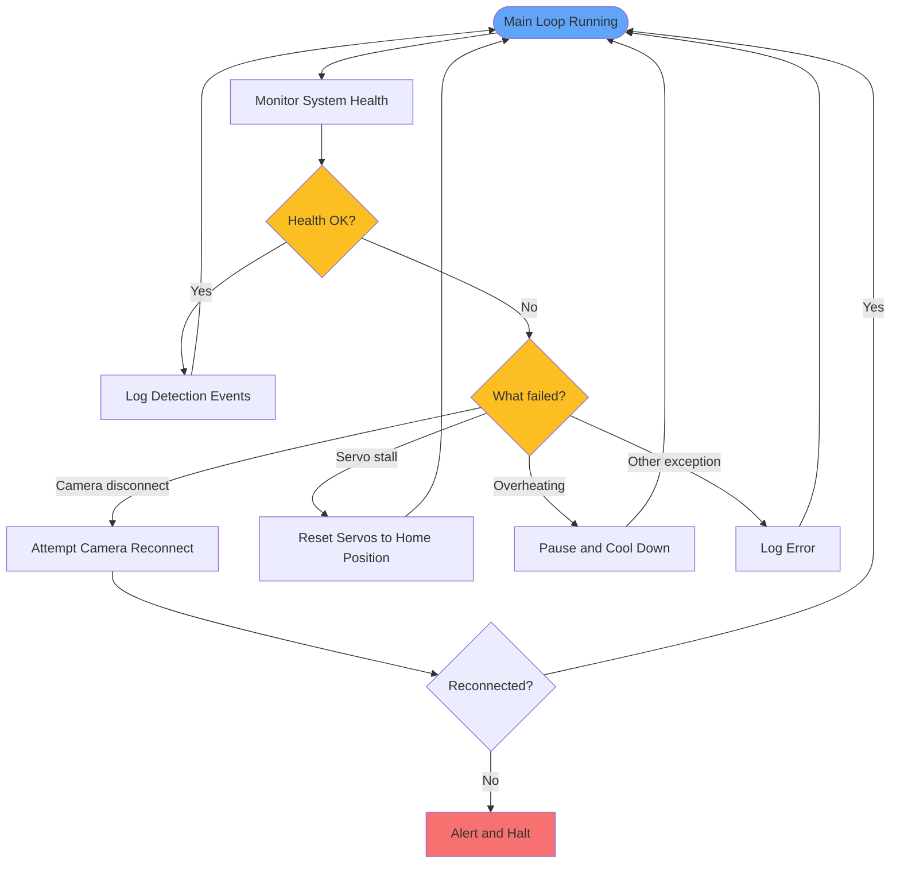

# Error Handling and Monitoring

Runs alongside the main loop to keep the system healthy 24/7.

## Notes

- **Temperature**: RK3588 can run warm under sustained NPU load — add a heatsink and small fan; log CPU temp each cycle
- **FPS tracking**: if inference drops below 5 FPS, log a warning — may indicate thermal throttling or model issue
- **Camera disconnect**: most common outdoor failure; implement a reconnect retry loop before halting
- **Systemd service**: run the main script as a systemd service with `Restart=always` so the OS auto-restarts after a crash
- **Optional alerts**: send a Telegram or email message on first detection of the day, or on any system fault

[Back to Overview](overview.md)
