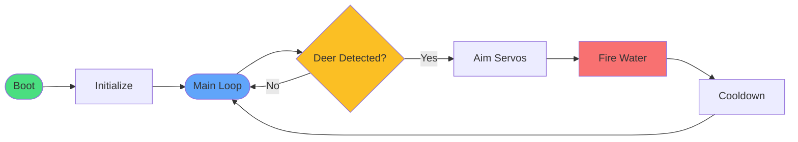

# System Overview

High-level flow of the deer defense system. Click into each section for detail.

## Detail Views

| Section | Description |
|---|---|
| [Initialization](01-initialization.md) | Boot sequence: loading model, camera, servos, config, calibration |
| [Detection and Targeting](02-detection-loop.md) | Frame capture → YOLO inference → servo aim → fire |
| [Error Handling and Monitoring](03-error-handling.md) | Temperature, FPS, logging, exception recovery |
