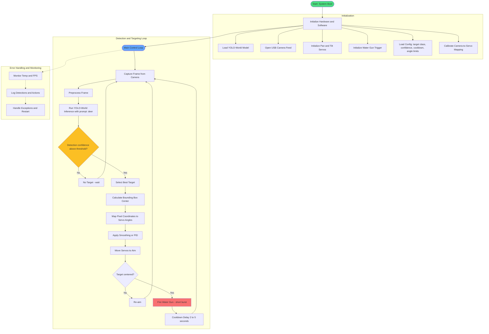

# System Logic Flowchart



## Logic Flow Explanation

1. **Initialization** (runs once at startup)
   - Loads the YOLO-World model (open-vocabulary — change the target text prompt without retraining)
   - Opens the camera and warms it up
   - Sets up servo control (0–180° pan/tilt)
   - Defines how pixel positions map to physical aiming angles (critical calibration step)

2. **Main Loop** (runs continuously, target: 10–30 FPS)
   - **Capture Frame**: Grabs the latest image from the USB camera
   - **Inference**: YOLO-World receives the frame + text prompt (`"deer"`) and returns bounding boxes with confidence scores
   - **Decision**: Only proceed if confidence exceeds threshold (e.g., >0.5) to avoid false sprays
   - **Coordinate Calculation**: Takes the center of the detected bounding box in pixel space

3. **Servo Mapping**
   - Linear mapping example: `pan_angle = (x / frame_width) * 180`
   - More accurate: homography calibration or lookup table
   - Optional PID / exponential smoothing prevents rapid shaking

   ```python
   def pixel_to_servo(x, y, frame_w, frame_h):
       pan  = 90 + (x - frame_w/2) * (90 / (frame_w/2))   # center = 90°
       tilt = 90 + (y - frame_h/2) * (60 / (frame_h/2))   # adjust multipliers
       return clamp(pan, 0, 180), clamp(tilt, 30, 150)     # safety limits
   ```

4. **Actuation**
   - Servos move to the calculated position
   - Once aimed, the trigger GPIO fires for a short burst (enough to scare, not soak)

5. **Cooldown & Loop**
   - Prevents continuous spraying on the same deer (2–5 second delay recommended)
   - Returns to capturing the next frame immediately
