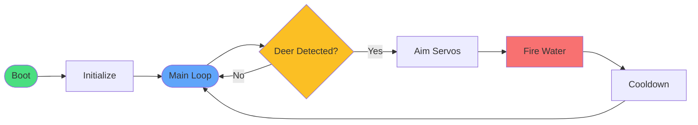

# Orange Pi 5 — System Overview

## High-Level Flow



## Detail Views

| Section | Description |
|---|---|
| [Initialization](01-initialization.md) | Boot sequence: loading model, camera, servos, config, calibration |
| [Detection and Targeting](02-detection-loop.md) | Frame capture → YOLO inference → servo aim → fire |
| [Error Handling and Monitoring](03-error-handling.md) | Temperature, FPS, logging, exception recovery |

---

## Basic Detection Loop

```python
import cv2

model = load_yolo_world("yolo_world_v2l.rknn")  # or ONNX for initial dev

cap = cv2.VideoCapture(0)

while True:
    ret, frame = cap.read()
    results = model.infer(frame, text_prompt="deer")

    for det in results:
        if det.conf > 0.5:
            x_center, y_center = get_bbox_center(det)
            aim_servos(x_center, y_center)
            trigger_water_gun(duration=0.5)  # short burst
            time.sleep(2)  # cooldown
```

**Model options**:
- **Easiest starting point**: Ultralytics YOLO-World → export to ONNX, run on CPU first
- **Full NPU acceleration**: Convert to **RKNN** format using `rknn-toolkit2`
  - Export model to ONNX → convert with Rockchip tools → run on RK3588 NPU

**Calibration**: Map camera FOV + resolution to servo angle ranges. Start with printed targets before deploying outdoors.

Start with **CPU/OpenCV + Ultralytics** for rapid prototyping, then move to NPU.

---

## Key Implementation Notes

- **Performance**: Orange Pi 5 + RK3588 NPU can achieve real-time tracking (10–30 FPS)
- **Target prompt**: Use `"deer"` as the YOLO-World text prompt; also try `"white-tailed deer"` for better accuracy
- **Fire zone restriction**: Only spray when the bounding box center falls within a defined pixel region (the garden rows), reducing false triggers on passing animals outside the protected area
- **Cooldown**: 2–5 seconds recommended for deer (longer than pigeons — deer take more convincing)
- **Multi-target**: Track the largest detection (deer are big) or highest-confidence one

---

## Resources

- YOLO-World official: https://github.com/AILab-CVC/YOLO-World
- Ultralytics YOLO-World docs (easier starting point for prototyping)
- Rockchip RKNN examples + Ultralytics RKNN export guide
- Thingiverse/Printables: search "pan tilt servo turret"
- Inspiration: [u/muxamilian's pigeon defense system](https://www.reddit.com/r/SideProject/comments/1s9ywir/automated_pigeon_defense_system/)
